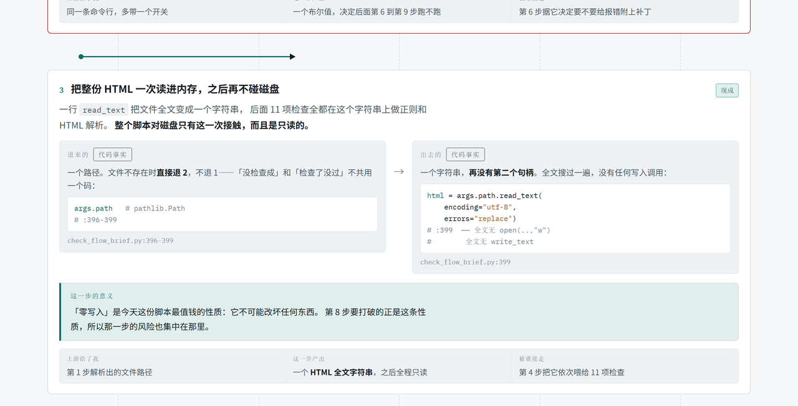

<h1 align="center">Flow Brief</h1>

<p align="center">
  <b>Turn a system, a module, or a feature you haven't built yet into one page your director will actually read —<br>
  where every claim wears a badge saying how you know it.</b>
</p>

<p align="center">
  <a href="#quick-start">Quick start</a> ·
  <a href="#the-five-rules">The five rules</a> ·
  <a href="#self-check">Self-check</a> ·
  <a href="README.zh-CN.md">中文</a> ·
  <a href="LICENSE">MIT</a>
</p>

<picture>
  <source media="(prefers-color-scheme: dark)" srcset="assets/hero-dark.png">
  
</picture>

<sub>Generated by an agent from a real codebase, unedited. The page speaks whatever language you asked in — this one came from a Chinese prompt. Both themes ship in the same file.</sub>

---

## Why this exists

Ask any coding agent for "a diagram explaining how this works" and you usually get one of
three failures:

- **It draws boxes, not flow.** Arrows everywhere, but you cannot see how the data changes
  shape from one step to the next.
- **It draws intentions as if they were reality.** The most damaging failure in anything
  written for leadership, and the hardest to spot from the outside.
- **It writes for peers.** Dense terminology, no framing, and your reader quits three lines in.

Flow Brief is a methodology plus a locked template plus a checker that refuses to pass work
that skipped the methodology. The agent fills in content; it does not get to redesign the
page — which is what makes the output consistent across different models and different runs.

## Quick start

```bash
npx skills add shaokeyibb/flow-brief
```

That is the whole install. The CLI finds the agents you already have and asks where to put
it. To target one directly:

```bash
npx skills add shaokeyibb/flow-brief -a claude-code
npx skills add shaokeyibb/flow-brief -a cursor
```

Works with any agent that reads skills — Claude Code, Cursor, Codex, Copilot, Gemini CLI,
opencode, Windsurf, Zed and [many more](https://www.skills.sh/).

Then just ask, in whatever words you would normally use:

> 给我画一张这个模块的介绍泳道图,下周要跟老板过一遍

> draw me a walkthrough of how a request gets from the API gateway to the database — the new hire starts Monday

> we're adding a retry queue to the ingest pipeline. make something for the design review that shows what's already there vs what we'd have to build

You get one self-contained `.html` file. No build step, no bundler, no server — double-click
it. It carries its own CSS, adapts to light and dark, and works down to a phone screen.

**Requirements:** Python 3.8+ for the structural check (standard library only). Node and
Chrome/Chromium are optional and only power the extra viewport check.

## What comes out

<picture>
  <source media="(prefers-color-scheme: dark)" srcset="assets/band-dark.png">
  
</picture>

Every step gets the same anatomy: **what goes in → what comes out**, each side badged with
how the author knows it, and a three-cell strip at the bottom answering *what upstream handed
me / what I produced / who picks it up*. That strip is not optional, and the checker enforces
it — it is the single highest-value thing missing from most generated diagrams.

## The five rules

Each one exists because of a specific failure mode. The skill states the failure alongside
the rule, because a rule whose purpose you understand survives contact with a case its author
never imagined.

| # | Rule | The failure it prevents |
|---|---|---|
| 1 | **Separate the modes** | Merging two genuinely different runs into one line, so the reader cannot tell which steps happen every time and which happened once. Most subjects have exactly one mode — the skill tells the agent *not* to invent a second one to look thorough. |
| 2 | **Node triad** | Boxes and arrows with no visible data flow. |
| 3 | **Evidence ladder** | Drawing an intention as if it were the current state. |
| 4 | **Three reading depths** | Writing for peers; the 30-second layer never gets written. |
| 5 | **Show the gap** | A page that reads as marketing and collapses at the first "so when does it *not* work?" |

Rule 3 is the one that changes how the work feels. Four rungs — **measured / code fact /
illustrative / to build** — and every factual cell on the page must pick one. The point isn't
that your reader will audit you. It's that **you can't fool yourself**: being unable to pick
a rung is the signal that you haven't finished collecting.

That also makes unbuilt work a first-class citizen. Diagramming a feature that doesn't exist
yet, the existing upstream and downstream come out as *measured*, the new parts come out as
*to build*, and the seam between them — where all the risk lives — is visible at a glance.

## Self-check

```bash
python scripts/check_flow_brief.py out.html            # structural, zero dependencies
python scripts/check_flow_brief.py out.html --visual   # + viewport and theme checks
```

Twelve checks. Some are hygiene (tag balance, markdown leaking into HTML, half-finished
themes, unwrapped wide tables). The interesting ones enforce the methodology: every band has
its data-flow strip, every box label carries a provenance badge, the page names at least one
gap, and code-fact claims cite `file:line` rather than just a filename.

**Exit codes are three-valued and never collapse:** `0` pass, `1` fail, `2` **unverified**
(Node or Chrome missing). A tool that returns 0 when it checked nothing is worse than one
that fails, because it teaches everyone to trust a green that means nothing.

Two properties worth knowing, both found by adversarial testing rather than by design:

- **Every check is mutation-tested.** Break one guard and exactly that guard goes red — ten
  mutations, ten hits, zero cross-talk. A check that never fails is decoration.
- **An empty file fails.** An early version scored a 7-line stub at zero errors while scoring
  a half-finished page at seven, because "no bands found" was a warning rather than an error.
  Absence is now a failure. This checker measures whether the work was done, not merely
  whether what exists is well-formed.

## What's in the box

```
flow-brief/
├── SKILL.md                     the methodology and the workflow
├── templates/skeleton.html      self-contained page: CSS, themes, responsive, components
├── references/
│   ├── collecting.md            how to gather material — code first, documents last
│   └── components.md            component reference, with the traps in each
└── scripts/
    ├── check_flow_brief.py      structural self-check (stdlib only)
    └── check_visual.mjs         optional viewport/theme check (Node + Chrome)
```

## Notes

**One network dependency.** The template links Google Fonts, so a generated page fetches
three faces the first time it opens. On an air-gapped network, or anywhere the page must not
phone out, delete the three `<link>` tags — the CSS falls back to system faces and the page
stays readable, just less distinctive.

**Language.** The page follows the language of your request. Identifiers, paths, commands and
error codes stay verbatim in any language.

## License

MIT — see [LICENSE](LICENSE).
